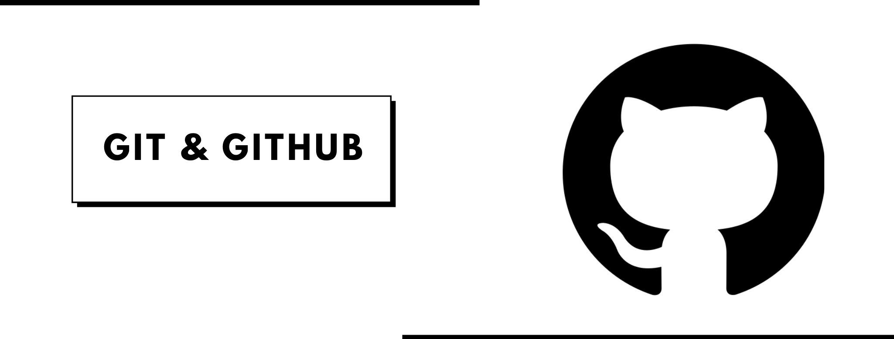

<h1 align="center">

<h1 align="center">🔗Git & Github</h1>

Simple web page dedicated to learning Git and Github

 
 

 

<h4 align="center">🚧  Git & Github 🔗Under construction..  🚧 👷</h4>

 

 <a href="#about">About the project</a> •
 <a href="#feature">Feature</a> • 
 <a href="#demo"> Application Demo</a> • 
 <a href="#requirements"> Requirements</a> • 
 <a href="#technology">Technology</a> • 
  <a href="#author">Author</a>• 
 <a href="#license">License</a> • 
 <a href="#versions">README Versions</a> • 

<h2 id="about">💻  About the project</h2>
The project aims to develop a web page using HTML, CSS and
Bootstrap for learning Git and Github.

<h2 id="feature">📌 Feature</h2>

### 
- [x] HTML page creation
- [x] Bootstrap implementation
- [x] Styling the page with CSS
- [x] Creating the repository 
- [ ] JavaScript implementation

<h2  id="demo">🖇️ Application Demo</h2>

<h2  id ="requirements">💻 Requirements</h2>

Before you start, you will need to have a text editor installed on your machine, recommended by 
Visual Estudio Code.

<h2  id="technology">  🛠 Technology </h2>

	The following tools were used in the construction of the project: 
∙	<a href="#">Html</a>  
∙	<a href="#">CSS</a>  
∙	<a href="https://getbootstrap.com/">Bootstrap</a>  
∙	<a href="https://git-scm.com/">Git</a>  
∙	<a href="https://github.com/">Github</a>  

<h2 id="author">✨ Author </h2>

  
 <b>Izabella Loyse Cândido</b>  
 Produced and developed with love by Izabella Loyse Cândido💙
  Get in touch 📝 I await you!

 

<h2 id="license" >📝 License</h2>

This project is under the  <a href="https://github.com/IzabellaLoyse/Git/blob/master/LICENSE">
MIT</a> license.

<h2 id="versions"> README Versions</h2>

<a href="https://github.com/IzabellaLoyse/Git/blob/master/README.md">Portuguese 🇧🇷</a> | 
<a href="https://github.com/IzabellaLoyse/Git/blob/master/README-en.md">English 🇺🇸</a>

 

