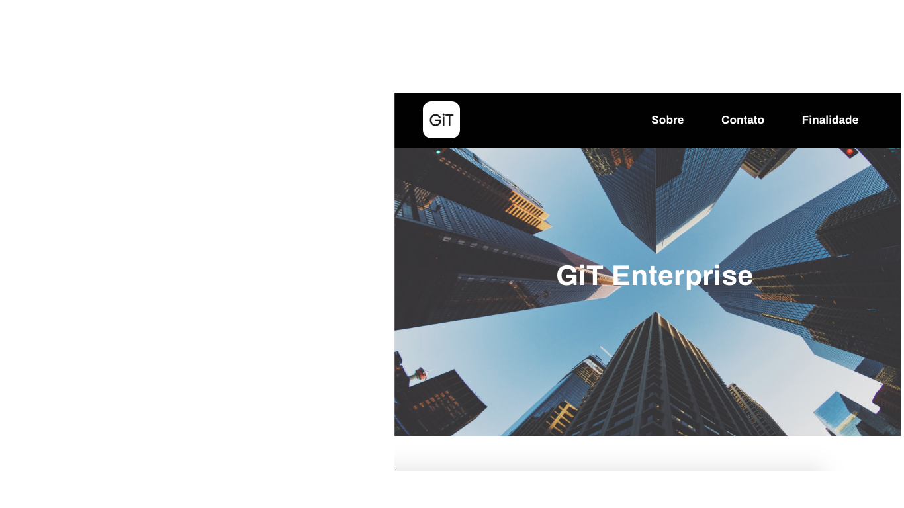

<h1 align="center">🔗GiT Enterprise</h1>

GiT Enterprise company website 

 

 

<h4 align="center"> 🔗GiT Enterprise • Finished•</h4>

 

 <a href="#sobre">About the project</a> •
 <a href="#aplicacao"> Application Demo</a> • 
 <a href="#requesitos"> Requeriments</a> • 
 <a href="#tecnologias">Technologies</a> • 
  <a href="#autor">Author</a>• 
 <a href="#licenca">License</a> • 
 <a href="#versoes"> README versions</a> • 

<h2 id="sobre">💻 About the project</h2>

  GiT Enterprise website, a company dedicated to the development of applications for the Internet.
    
  The elaboration and development of the website is part of the developer's personal projects.

<h2 id="aplicacao">🖇️ Application Demo</h2>

• To view and interact with the Site, access <a href="https://git-azure.vercel.app/Index.html"> GiT Enterprise</a>

<strong> responsive website</strong>

<h2  id="requesitos">💻 Requeriments</h2>

Before you begin, you will need to have a text editor installed on your machine,
Visual Estudio Code is recommended. If you want you can download Sass directly
site or use a Visual Studio Code Plugin for compilation.

<h2 id="tecnologias">  🛠 Technologies</h2>

	The following tools were used in the construction of the project: 
∙	<a href="#">Html</a>  
∙	<a href="#">CSS</a>  
∙	<a href="https://sass-lang.com/">Sass</a>  

<h2 id="autor">✨ Author</h2>

  
  <b> Izabella Loyse Cândido </b>   
  Produced and developed with love by Izabella Loyse Cândido💙
  Get in touch 📝 I await you!

 

<h2 id="licenca" >📝 License</h2>

This project is under license <a href="https://github.com/IzabellaLoyse/Git/blob/master/
LICENSE">MIT</a>. 

<h2 id="versoes"> README versions</h2>

<a href="https://github.com/IzabellaLoyse/Git/blob/master/README.md">Português 🇧🇷</a> | 
<a href="https://github.com/IzabellaLoyse/Git/blob/master/README-en.md">English 🇺🇸</a>

